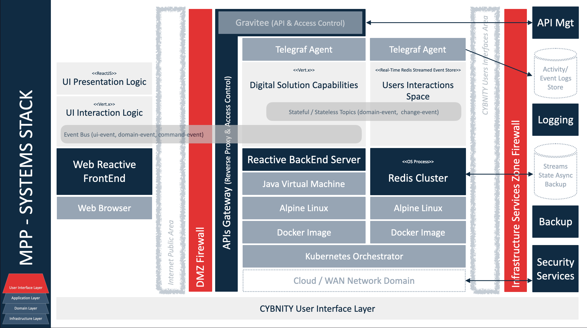
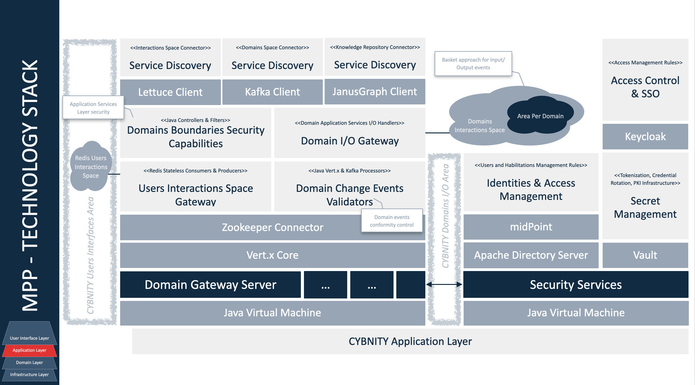
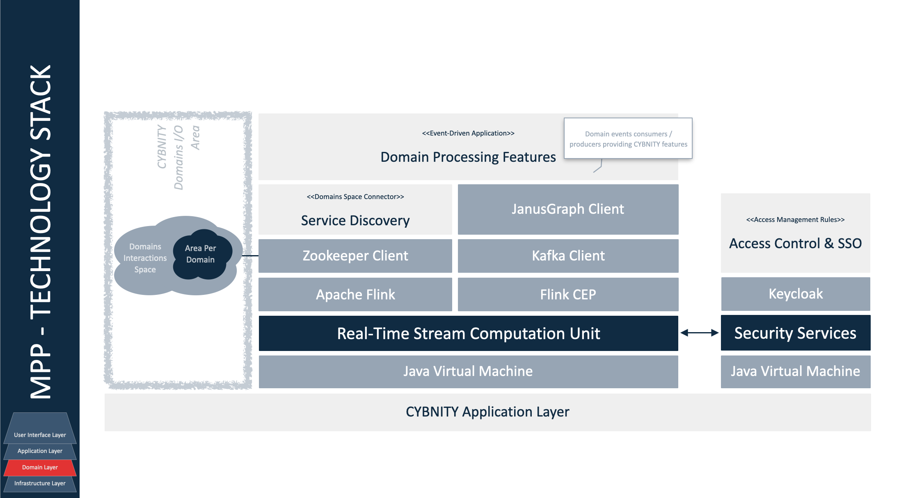
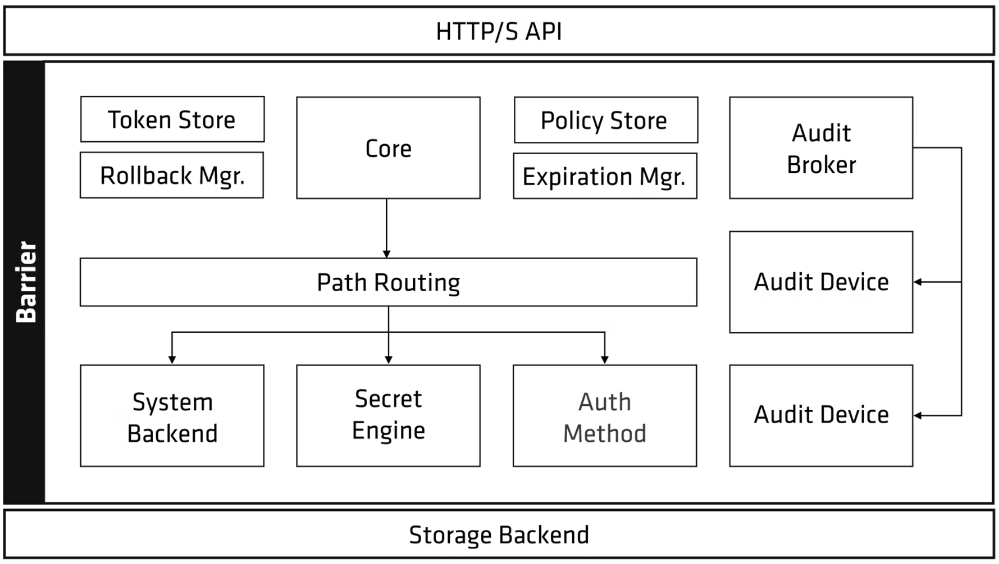
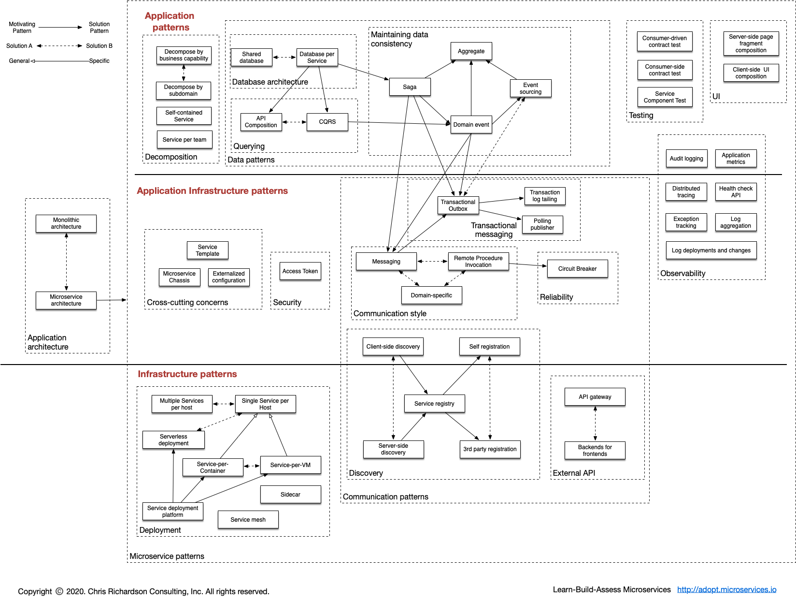

## PURPOSE
This section develop, document and elaborate detailed design progressively using agreed-on and rapid agile development techniques, addressing all components (business processes and related automated and manual controls, supporting IT applications, infrastructure services and technology products, and partners/suppliers). Ensure that the detailed design includes internal and external SLAs and OLAs.

This section presents the design specifications about the solutions and technology approved for build.

# WHY & WHAT TARGETED OBJECTIVES
## GOALS
Respond to the set of common requirements defined as frame of principles need to be maintained by any version of the CYBNITY official technology stack.

Definition of a minimal set of components allowing to:

- build and deliver a first version of CYBNITY demonstrator regarding UI cockpits principles;
- build and deliver a first version of a CYBNITY prototype of basic features for demonstration to potential partners' ecosystem.

## REQUIREMENTS
### Architecture
Should allow build of a first implementation architecture respecting the target architecture defined by Foundation project ready for deployment as an Internet platform usable for demonstration and motivation of partnerships.

### Design & Demonstrator
Should provide basic technologies set allowing the development of a first prototype aligned with the visual demonstrator of Cockpits concept.

### User Interface Layer
#### Dynamics
Should be real-time: frontend and backend components should maintain up-to-date states of domain events (e.g domain data state changes) and collaboration data (e.g shared data, contextualized capabilities during a security crisis situation) when collaboration data are managed in real-time between several CYBNITY users connected via their CYBNITY cockpits).

#### Context and local persistence
Should proposed personal management of real-time data dedicated to the connected user in dedicated space (e.g session during cockpit access, when a user prepare a draft of a security information before to commit it in a transaction mode to a CYBNITY domain).

#### Integration with domains
Should be integrated in real-time with domain over bridge to event bus and data spaces shared with security domains (e.g centralized), in a standard mode allowing scalable backend/frontend services, but with a standard integration to the domain applications (e.g application components) via middleware platform (e.g Redis).

### Application Layer
#### Processing and distribution of load
Should start in a moderate time duration, but should have an acceptable reactivity SLA during the demonstration period allowing to check a realistic behavior of the UI Cockpits principles.

None requirement about support of data volume operated by the demonstrator using the stack (first phase of the CYBNITY project without challenges about the data load performance).

#### Access and usage via Internet
Should be usable via Internet for remote demonstration through a web browser hosted on a laptop or tablet, connected to Internet over a 4G bandwidth.

### Infrastructure Layer
#### Environments and locations
Should support implementation of applications capable to run on several infrastructure environment types (environment profiles):
  - **local**: developer's workstation during unit development activities;
  - **dev**: common development server shared between developers collaborative activities and integration tests during unit development of integrated features;
  - **test**: server environment (no mirror of production environment) dedicated to quick tests when lot of infrastructure or environment changes are developed;
  - **staging**: pre-production server environment (mirror of production environment) that contain next version of applications, used for final integration testing and for test/demonstration of deployment repetition or performance demonstration;
  - **production**: production (live) server environment.

#### Hosting and execution platform
Should be virtualizable (e.g Docker containerized) allowing an installation/execution on a public cloud host (e.g IAS, PAAS), or an independent laptop (e.g OS on x64, ARM64 processing unit) without Internet connection.

### Tooling & Supervision
Should allow definition and test of basic software factory implementation allowing to deliver Dockerized systems.

None supervision requirements required regarding the step of the CYBNITY Foundation project.

# SELECTED IMPLEMENTATION ARCHITECTURE
Presentation of the retained implementation stack resulting of the analysis steps result and stack definition.

| TECHNOLOGY | USABLE ON PLATFORM TYPES | AUTHORIZED ENVIRONMENTS | AUTHORIZED ROLES |
| :--- | :--- | :--- | :--- |
| |Web, Monitoring, Centralized Storage, Middlewares|Local, Dev, Test, Staging, Production|UI Layer, Application/Domain Layer, Application/Integration/Persistence/Indexing/Monitoring/Operating/Physical Infrastructure, Delivery Tool|

## UI Layer

## Application Layer

## Application-Domain Layer

## Infrastructure Layer

# STACK DEFINITION PROCESS CURRENT STATUS
Find here the current selected technologies set which are finally retained as valid stack after their analysis steps passed with success. This is the conclusions that are coming as outputs from the technology analysis stream executed.
The current status of technology already in the analysis stream give a general view which one is always in the race:

- Always in study `X`
- Opportunity as alternate challenger `ALT`
- Retained `WIN`

| Layer / Role | Component Name | IDEA STAGE - Implementation Technology Opportunity | ANALYSIS STAGE - Specification Validated | DESIGN STAGE - Design Tested | IMPL STAGE - Implementation Tested | Comments |
| :--- | :--- | :--- | :---: | :---: | :---: | :--- |
| UI | Web GUI Graphic Components Library | [ReactBootstrap](https://react-bootstrap.github.io/) | `WIN` | | | UI widgets foundation, re-written bootstrap components in React, 445 contributors |
| UI | Web GUI CSS Components Library | [MaterializeCSS](https://github.com/Dogfalo/materialize) | `ALT 1` | | | UI widgets usable [with ReactJS](http://fullstackhybrid.com/using-materializecss-with-reactjs/) based on Google's Material Design that incorporates custom components to provide default stylings, 261 contributors |
| UI | Web GUI CSS Components Library | [Pure CSS](https://github.com/pure-css/pure) | `ALT 2` | | | UI widget based on CSS as a set of small responsive CSS modules (minimalism and small size); can be integrated with bootstrap components, 66 contributors |
| UI | Web GUI CSS Components Library | [Ulkit](https://github.com/uikit/uikit) | `ALT 3` | | | UI widget based on CSS [usable with reactive JS framework](https://getuikit.com/docs/javascript), MIT license, 34 contributors |
| UI | Web GUI Reactive Frontend Library | [Vert.x SockJS Client](https://github.com/sockjs/sockjs-client) | `WIN` | `WIN` | | JavaScript event bus bridge to Vert.x server-side reactive services |
| UI | Web GUI Reactive Frontend Library | ReactJS | `WIN` | | | HTML/CSS view from rendering components based with data changes auto-refresh, according to a View / Presenter pattern approach |
| UI | Client-Side Data Model Format | JSON | `WIN` | `WIN` | | Data and CQRS events (e.g Data Transform Object, Command/Query/Domain events) |
| UI | Server-Side Reactive Backend Server | Eclipse Vert.x | `WIN` | `WIN` | | UI reactive services (e.g UI cockpit capabilities) and processors (e.g UI behavior logic) managing access control, controllers collaboration (e.g event bus) and command/data events integration (via Redis client) with application(s) services layer via Application Domains Access Hub |
| APPLICATION / DOMAIN | Users Interactions Space Library | Redis Connector | `WIN` | | | Embedded memory database (streamed events store) client for UI messages and application domains integration between UI layer and application layer; [Jedis](https://github.com/redis/jedis) java client for Redis cluster discovery |
| APPLICATION / DOMAIN | Domains Interactions Space Library | Kafka Connector | `WIN` | | | Embedded memory database (streamed events store) client for application domains events between applications and domains layer |
| APPLICATION / DOMAIN | Domains Events Validation | [Kafka processors/consumers api](https://kafka.apache.org/) | `WIN` | | | Stateless Anti-Corruption Layer (e.g Application Services Layer), remote proxy, input/output ports executed into JVM with Kafka connector API (e.g Java client), validators of domain events (e.g quality and conformity control) |
| APPLICATION / DOMAIN | Real-Time Stream Computation | Apache Flink | `WIN` | | | Cluster framework for stateful data processing, CEP, data pipeline job running into a Flink cluster, Saga [Pattern](https://microservices.io/patterns/data/saga.html) for transactional flow |
| APPLICATION / DOMAIN | Real-Time Data Stream Computation | [Kafka Streams](https://kafka.apache.org/documentation/streams/) Client Library | `ALT` | | | Library for stateful data processing (e.g CYBNITY process / feature modules) and pipeline running into independent application implementation |
| APPLICATION / DOMAIN | Application Context Manager | Spring Core | `ALT` | | | Injection of dependency, configuration of assembled applicative components and technical services |
| APPLICATION INFRASTRUCTURE | Services Discovery | Zookeeper Client | `WIN` | | | Client for discovery of services (e.g Kafka brokers) and/or to maintained configuration information (e.g service names, properties) as connector to contents |
| APPLICATION INFRASTRUCTURE | Domains Interactions Space | [Kafka Cluster](https://kafka.apache.org/) | `WIN` | | | Distributed memory database in event-driven approach for management of domains inputs/outputs via embedded mode (distributed data cluster); [Kafka Backup](https://medium.com/@anatolyz/introducing-kafka-backup-9dc0677ea7ee) consists of two Connectors for Kafka Connect: One for Backup (Implemented as a Sink Connector) and one for the restore of data (Implemented as a Source Connector) |
| APPLICATION INFRASTRUCTURE | Java Runtime Environment | Eclipse Temurin JDK/JRE 11 | `WIN` | `WIN` | | Execution environment of application service layers; [Documentation](https://www.eclipse.org/openj9/docs/index.html); Temurin version managed by Eclipse project as successor of OpenJ9 (IBM) |
| APPLICATION INFRASTRUCTURE | Java Runtime Environment | Liberica JDK | `ALT` | | | |
| APPLICATION INFRASTRUCTURE | Access Control & Single-Sign-On | [Keycloack](https://www.keycloak.org/) | `WIN` | | | Dynamic part of the IAM solution that works with the data in the real time; SAML2.0 protocol for user authentication with SSO |
| APPLICATION INFRASTRUCTURE | Identity & Access Management | midPoint | `WIN` | | | IDM system implement integration part of the IAM solution that move the data around; maintain data in the directory service (identity store); Federation, RBAC or ABAC based on attributes; place to apply policies, such as Role-Based Access Control (RBAC), Segregation of Duties (SoD), and various policies for compliance with regulations; SPML (to create users/permissions as access provisioning) |
| APPLICATION INFRASTRUCTURE | Identity Repository | Apache Directory Server | `WIN` | | | Identity Management (IDM) static part of the IAM solution that store the data (e.g in LDAP identities repository) |
| APPLICATION INFRASTRUCTURE | Secrets Management | [Vault](https://www.vaultproject.io/) | `WIN` | | | PKI, credentials, passwords, api keys via secrets engines and authentication methods like JWT/LDAP/pki certif/Token for partners API integration/connectors |
| INTEGRATION INFRASTRUCTURE | Users Interactions Space | Redis | `WIN` | `WIN` | | Datastore with async ports and protocol for application exchanges (e.g domain events and requests); [Redis in action book](https://redis.com/ebook/redis-in-action/); [redis persistence](https://redis.com/redis-enterprise/technology/durable-redis/) |
| INTEGRATION INFRASTRUCTURE | Services Registry & Coordination | Apache Zookeeper | `WIN` | | | Services and data registry, configuration management with resources directory (e.g Kafka broker instances) |
| INTEGRATION INFRASTRUCTURE | APIs Gateway & Management | Gravitee.io | `WIN` | | | HTTP Reverse Proxy, CYBNITY API access control, API documentation/management/analytics/administration/design for User Interface Layer access (e.g reverse proxy, load balancing, access policies) and external APIs connections management |
| INTEGRATION INFRASTRUCTURE | Remote Services Integration | Resilience4J | `ALT WITHOUT SERVER-SIDE API GATEWAY` | | | Embedded library for integration with external APIs without APIs Gateway support (circuit breaker, rate limiting for executions/period, bulkhead for concurrent execution limitation, automatic retry of failed executions, timeout handling, successful result caching, fallback to result failures; add-on for Spring, Vert.x) |
| INDEXING INFRASTRUCTURE | Contents Indexing & Search | Apache Solr | `WIN` | | | Lucene indexing and query of time series contents (e.g logs, backups), documents (e.g pdf) |
| PERSISTENCE INFRASTRUCTURE | Activity / Event Logs Store | [InfluxDB](https://www.influxdata.com/) | `WIN` | | | Time series data platform as NoSQL database for efficient storage (write optimized) of systems' metrics, traces, events, and logs |
| PERSISTENCE INFRASTRUCTURE | Streams State Async Backup | MongoDB | `WIN` | | | Autonomous dynamic backup/recovery of distributed data, collection-oriented repository |
| PERSISTENCE INFRASTRUCTURE | In-Memory Data Grid (Cluster Manager) | Infinispan | X | | In-memory distributed data store storing, managing, and processing data; [Doc](https://infinispan.org/) |
| SECURITY INFRASTRUCTURE | Traffic Health, Configuration Mesh & Networking | Consul | `WIN FOR SERVER-SIDE` | | | Service registration and discovery, health checking, distributed key-value store, TLS, ACL to data & api, key generation, dynamic load balancing, multi-data centers support, data encryption, REST api, CLI, administration web-ui |
| SECURITY INFRASTRUCTURE | Services Observability, Traffic & Security Monitoring | Istio | `ALT FOR SERVER-SIDE` | | | Settings mesh of container urls to maintain service information like track/monitor services, load balancing, services discovery and registration; competitor of Consul about several capabilities |
| MONITORING INFRASTRUCTURE | Data Visualization & Alerting | Grafana | `WIN` | | | Dashboard, alert and analytics of systems events (from Activity/Event logs store) |
| MONITORING INFRASTRUCTURE | System Monitoring | Telegraf Agent | `WIN` | | | Client-side agent installed on a system (e.g application, ui backend, microservice via Java client library, or pre-built agent) that push events (e.g metrics, logs, traces) to Activity/Event Logs Store |
| OPERATING INFRASTRUCTURE | Linux Operating System | Ubuntu 64bits kernel | `ALT` | | | LTS minimal optimized version, security patch and vulnerability monitoring by Canonical |
| OPERATING INFRASTRUCTURE | Linux Operating System | Alpine 64bits kernel | `WIN` | `WIN` | | Docker optimized |
| OPERATING INFRASTRUCTURE | Executable System | Docker Image | `WIN` | `WIN` | | Template of CYBNITY packaged system ready for run on a virtualized infrastructure (Infra-As-Code Execution type) |
| OPERATING INFRASTRUCTURE | Infra-As-Code Execution | MicroK8s | `WIN` | | | Kubernetes for laptop, local dev deployment |
| OPERATING INFRASTRUCTURE | Infra-As-Code Execution | Minikube | `ALT` | | | Kubernetes for laptop, local dev deployment |
| OPERATING INFRASTRUCTURE | Infra-As-Code Execution | Kubernetes orchestrator | `WIN FOR SERVER-SIDE` | | | Server deployment; execution of Flink functions/CEP/data stream processors, and of Docker images |
| PHYSICAL INFRASTRUCTURE | Processing Unit | x86 | `WIN` | `WIN` | | |
| PHYSICAL INFRASTRUCTURE | Processing Unit | ARM | `WIN` | | | |

# Industrialization Tools
| Layer / Role | Component Name | IDEA STAGE - Implementation Technology Opportunity | ANALYSIS STAGE - Specification Validated | DESIGN STAGE - Design Tested | IMPL STAGE - Implementation Tested | Comments |
| :--- | :--- | :--- | :---: | :---: | :---: | :--- |
| BUILD TOOL | Components Build | Maven | `WIN` | `WIN` | | Build (e.g application component), install and push into Artifacts Repository |
| BUILD TOOL | System Docker Images Build | Skaffold | `WIN` | | | Build (e.g docker image template of packaged system ready for run) and push Docker image into artifacts repository (e.g Docker Hub) |
| DELIVERY TOOL | Artifacts Repository | Nexus | `WIN` | | | Hosting and management of several artifact types (e.g packaged library) and versions (e.g jar versions) |
| DELIVERY TOOL | Integrated Build / Delivery | HashiCorp Waypoint | X | | | Build, deploy, release and publish Docker application images on Kubernetes infrastructure |
| DELIVERY TOOL | System Docker Images Delivery | Spinnaker | `WIN` | | | Deploy, release and publish Docker application images on Kubernetes infrastructure (e.g environments templates defined by Helm chart manifests) |

# TECHNOLOGY ANALYSIS STREAM

## STEP 1 - Eligibility Check
During this step, the candidate technologies are identified and their study is mainly based on their documentations according to the promised announced by their editors/providers.
The first set of technologies identified like potential interesting candidate is coming from market proposal and/or team members experiences.
The eligibility criteria acceptance level are evaluated as:

- Incompatible or Discarded `KO`
- Acceptable `OK`
- Good `COOL`

The criteria checked about advantages (ADV) are:

- ADV01: Intellectual Property (IP) dependency and risks coming from supplier/license model or conflict with Apache 2.0;
- ADV02: virtual infrastructure compatibility, flexibility and/or optimization (e.g ARM, vector calculation, GPU);
- ADV03: simplicity of build, deployment, maintenance and tooling for developers;
- ADV04: sustainability and dynamics usage/developers community/project roadmap.

| CANDIDATE TECHNOLOGY | Description | Comments | ANALYSIS RESULT |
| :--- | :--- | :--- | :--- |
| [Gravitee](https://www.gravitee.io/) |[API Gateway](https://www.gravitee.io/platform/api-management) and designer of API; API Access Management   **ADV01:** Apache 2 license; several projects [on github](https://github.com/gravitee-io) **ADV02:** Docker image, Kubernetes, Amazon AWS  **ADV03:** several protocols supported (e.g SOAP, REST, RabbitMQ, Webhooks, gRPC, Kafka); [API Designer](https://www.gravitee.io/platform/api-designer?hsLang=en); automatically generates OpenAPI documentation; testing and validation (dynamically generated mock data to test new variables and features); export API specifications as a JSON, access policies (50 pre-built policies) via policy studio for create APIs policy; several protocols supported ; load balancing and failover; api debugger; [access mgt](https://www.gravitee.io/platform/access-management?hsLang=en) and api security (authentication and authorization services for seamless, secure APIs); API observability (monitor and secure the entire API landscape with Gravitee’s Alert Engine); [several protocols supported](https://github.com/gravitee-io/gravitee-access-management) for access mgt (e.g SAML 2, OpenID); Gravitee Cockpit is a centralized, multi-environment tool for managing all the Gravitee API Management and Access Management installations ; several [plugins](https://docs.gravitee.io/apim/1.x/apim_overview_plugins.html)  **ADV04:** support by gravitee team (STS and LTS support)|**Advantage:** features, security protocols supported, [large documentation](https://docs.gravitee.io/); better than Kong (UI available in OSS edition, multiple-protocol proxying, API Developer Portal in OSS edition, header based routing in OSS, policy application, native multi-factor authentication, native support for biometric authentication), OAuth2 introspection and mTLS AuthN included in OSS|`COOL`|
| [API Umbrella](https://github.com/NREL/api-umbrella) |API management platform for exposing web service APIs; For API creator (acts as a layer above your APIs; API code doesn't need to be modified to take advantage of the features provided; scale the APIs); for API consumer (unify disparate APIs and present separate APIs as a cohesive offering to API consumers; all the APIs are can be accessed using the same API key credentials; standardize documentation with all APIs documented in a single place and in a similar fashion); see [architecture](https://api-umbrella.readthedocs.io/en/latest/developer/architecture.html) about gatekeeper mode  **ADV01:** MIT license **ADV02:** Linux installations; Docker **ADV03:** web console for APIs administration; analytics menu; HTTP caching layer in front of the APIs (using [Apache Traffic Server(https://trafficserver.apache.org/) HTTP 1/2 caching proxy server); headers can optionally be used to identify details about the requesting user; “roles” feature can be used to restrict access to APIs so that only certain API keys may access the API; HTTPS configuration (handle the SSL termination with that external load balancer; SSL certificate installation); SMTP settings; Elastic search/mongoDB for load balancer / clustering features; rate limits|**Advantage:** simple and focus on essential for api admin, over web console or REST API **Disadvantage:** small area of analytics view; no features about security control/monitoring|`KO`|
| MicroK8s |Automates or simplifies operations such as deployment, clustering, and enabling of auxiliary services required for a production-grade K8s environment. Compared to other lightweight distributions MicroK8s is the only option that provides a single-command installation, automatic high availability clustering and automatic updates **ADV02:** x86/ARM64; multi-node cluster support; automatic high availability; automatic updates; memory requirements 540MB; the isolation is achieved by packaging all the binaries for Kubernetes, Docker.io, iptables, and CNI in a single snap package (available only in Ubuntu and compatible distributions) **ADV03:** container runtimes (containerd, kata); transactional over-the-air patching and security fixes, provided through the snap package **ADV04:** developed by Kubernetes teams of Canonical and supported by Canonical|**Advantage:** easy to install, upgrade, remove; completely isolated from other tools in a machine **Disadvantage:** only via [Snap](https://snapcraft.io/snapd)|`OK`|
| Minikube |Runs a single-node Kubernetes cluster inside a VM (e.g. Virtualbox) in a local development environment; is a local Kubernetes endpoint that you can use with the kubectl client **ADV02:** x86/ARM64; memory requirements 2GB; windows, mac, linux (can work with or without an intermediate VM on Linux) installation **ADV03:** container runtimes (Docker, containerd, CRI-O); multiple drivers that can match any environment; several plugins (such as dashboard) by default|**Advantage:** perfect for people that are using multiple OS machines and have some basic familiarity with Kubernetes and Docker; mature solution; flexible on installation requirements and upgrades|`OK`|
| Vault |Trusted authority for application and machine identities; secure, store, and access credentials and resources for user identity; Key/Value store for secrets, with flexibility and configurability with topics such as secret engines, authentication methods, and access policies  **ADV01:** [Mozilla Public License 2](https://github.com/hashicorp/vault/blob/main/LICENSE)  **ADV02:** [several installations](https://www.vaultproject.io/downloads) for Linux, Windows, macOS; [docker image](https://hub.docker.com/_/vault/); [Kubernetes compatible with Helm example](https://www.vaultproject.io/docs/platform/k8s/helm); [High-Availability](https://www.vaultproject.io/docs/concepts/ha) capabilities; [reference architecture with Consul integration](https://learn.hashicorp.com/tutorials/vault/reference-architecture) **ADV03:** variety of secret and auth backends; dynamic secret generation; auditLog; leasing and renewal; Privilege Access Management (PAM); integrations for Kubernetes, Spring, and officially supported client libraries for Go and Ruby; fetching of secrets via the CLI, REST API, or community-maintained [open source libraries](https://www.vaultproject.io/api/libraries#community); auth method such [App Role](https://www.vaultproject.io/docs/auth/approle) or additional precautions such as [Cubbyhole response wrapping](https://learn.hashicorp.com/tutorials/vault/cubbyhole-response-wrapping); [integration with Consul](https://learn.hashicorp.com/tutorials/vault/ha-with-consul); [Vault Helm Charts](https://github.com/hashicorp/vault-helm) project; Java spring client library for connect to Vault **ADV04:** HashiCorp provides Vault Enterprise, a fully managed version running on HashiCorp Cloud Platform (HCP)|**Advantage:** easy to set up and use; list of integrations, primarily focusing on authentication and secret storage|`COOL`|
| midPoint Evolveum |Open source ecosystem for identity and access management focused on how the data is processed, auditing, and provide data rectification and erasure options out-of-the-box; identity governance and administration (automated access request, provisioning and deprovisioning, policy and roles management, auditing, access certification); 3rd-parties solutions licenses management; identity data visibility and accountability compliance (gdpr); consent management and identity data; user access self-services (password, access request, profile); [all features](https://docs.evolveum.com/midpoint/features/current/)  **ADV01:** Apache License and European Union Public License **ADV02:** [requirements](https://docs.evolveum.com/midpoint/install/system-requirements/); [Docker Alpine image installation](https://docs.evolveum.com/midpoint/install/docker/); need JRE 11+  **ADV03:** synchronize identities stores across all the inbound and outbound resources; PostgreSQL repository implementation internally; RBAC/ABAC supported; organizational structure, group membership, access control lists (ACLs), privileges managed; web UI for uiam management **ADV04:** professional support; [rich tutorial](https://evolveum.com/get-started/) and documentations by evolveum; LTS program; large identity [connectors](https://docs.evolveum.com/connectors/connectors/); [shared roadmap](https://docs.evolveum.com/midpoint/roadmap/)|**Advantage:** lot of integration with third-party solution around the identity management; very large documentations for IAM management and segregation of duties between the components **Disadvantage:** complementary solution to external directories|`COOL`|
| [Apache Directory Server](https://directory.apache.org/) | **ADV02:** written in Java **ADV03:** certified as LDAP v3 compliant by the Open Group (ApacheDS), and Eclipse-based directory tools (Apache Directory Studio); supports Kerberos 5 and the Change Password Protocol; [Apache directory studio](https://directory.apache.org/studio/) LDAP browser| |`OK`|
| [Keycloack](https://www.keycloak.org/) |Access management system; single-Sign On, user accounts and authorizations management; fine-grained support of [abac/rbac/ubac/cbac policies](https://www.keycloak.org/docs/latest/authorization_services/index.html) for authorization services **ADV01:** Apache 2 license **ADV02:** Java 11+ supported; compatible under [Docker](https://www.keycloak.org/server/containers) and Kubernetes; several database supported (e.g postgre, mysql, mariadb); low resources required (512Mo RAM, 1Go disk space) **ADV03:** integration with identity providers (e.g via OpenID Connect, SAML 2.0, Kerberos); user accounts federation (e.g LDAP, Active Directory, RDBMS servers) or stand-alone implementation; admin console (e.g update the profile, change passwords, and setup two-factor authentication); management of authorization policies; OAuth2 supported; administration RESTful api; TLS for end-point exposure; tenant with realm for applications and/or users groups management; clients adapters (e.g javascript, SpringBoot via OpenID); [extensions](https://www.keycloak.org/extensions.html); [theming extension with React](https://www.keycloakify.dev/); [France Connect connector](https://github.com/InseeFr/Keycloak-FranceConnect) **ADV04:** sponsored by Redhat|**Advantage:** Keycloack's token are digitally signed so the app just need to verify the digital signature without contacting the Keycloack server; Identity brokering; efficient support community and active forums; clear documentation|`OK`|
| [CAS](https://github.com/apereo/cas) |Single sign-on solution **ADV01:** Apache 2.0 licensed **ADV02:** Docker compatible; based on SpringBoot/Cloud; Java 11+ supported; Apache Tomcat used **ADV03:** Java server component; lot of protocols supported (e.g OAuth2, SAML2, OpenID...); authorization via ABAC; delegated authorization (e.g Facebook, Twitter, OpenID connect...); HA clustered deployments via Hazelcast, Ehcache, JPA, Apache Cassandra, Memcached, Apache Ignite, MongoDb, Redis, DynamoDb, Couchbase and more; application registration backed by JSON, MongoDb, Redis and more; multifactor authentication via Duo Security, YubiKey, RSA, Google Authenticator, U2F, WebAuthn and more; administrative UIs; user interface theme and branding; password management and password policy enforcement; Spring Webflow to do script processing of login and logout protocols **ADV04:** project under control by Apereo with announced [roadmap](https://www.apereo.org/projects/cas)|**Disadvantage:** CAS server's token must be verified by contacting the CAS server (so both user and app need to access the CAS server) but [CAS Service Tickets are signed and can be verified](https://apereo.github.io/cas/development/installation/Configure-ServiceTicket-JWT.html) without contacting the CAS Server|`OK`|
| [Apache Syncope](https://syncope.apache.org) |Cross-platform solution for managing digital identities, covering identity management process (provisioning, auditing, reporting, administration, policy management, password management, password policy management) **ADV01:** Apache 2.0 license **ADV02:** implemented in JEE technology **ADV03:** REST API; admin UI; end-user UI web app for self-registration, self-service and password reset; JAX-RS 2.0 RESTful interface to consume services; ConnId for communication with Identity Stores compatible (e.g Google apps, OS, Windows AD, databases) connectors (e.g CSV directory, LDAP, database table, SOAP)|**Disadvantage:** good for integration with complementary IAM sub-systems but need more components for quiakc/easy deployment; risk on complexity and low features implemented by default|`KO`|
| [Gluu](http://gluu.org/) |Identity and access management; Customer Identity and Access, Two-Factor authentication; Identity brokering **ADV01:** Gluu [licensed](https://gluu.org/docs/gluu-server/4.4/#license) (complex about open source components scope) **AD02:** Ubuntu/Debian/centOS/Redhat packages; Kubernetes compatible **ADV03:** OpenID provider (profile, centralized authentication for web/mobile); full FIDO server stack; user managed assess to interact with a person post-authentication (e.g consent); SAML 2.0, OAuth 2.0, SCIM, LDAP, Radius (open source Radius server called Radiator is recommended than very small implementation by default embedded in Gluu) supported; priced cluster manager|**Disadvantage:** doubt on open source licensing with potential risk for CYBNITY customers|`KO`|
| [Jaeger](https://www.jaegertracing.io/) |Systems monitoring & troubleshooting as end-to-end distributed systems tracing; monitoring of microservices-based distributed systems about context propagation, transactions, root causes, services dependencies, performance/latencies **ADV01:** Apache 2; vendor specific **ADV03:** compatible with trace storages (e.g Cassandra, InfluxDB, in-memory storage); Jaeger WebUI (React app); backend provided over Docker images with Kubernetes; expose by default Prometheus metrics and observable over stdout standard logs in zap structure; Jaeger-client in application, communicating with jaeger-agent embedded on execution container which directly push to storage database or via Kafka|**Advantage:** TLS securized log collected via Kafka **Disadvantage:** none integration with InfluxDB and/or via replaced agent with Open Telemetry|`KO`|
| [Open Telemetry](https://grafana.com/oss/opentelemetry) |Tools, APIs, SDKs to instrument, generate, collect and export telemetry data (e.g metrics, logs, traces) as standard in place of vendor specific collectors **ADV02:** instrumentation library per language; apk, deb, rpm, windows, macos installation **ADV03:** single collector binary deployed as agent or gateway; end-to-end implementation to generate, emit, collect, process, export telemetry data; support multiple context propagation formats; collector possibility to be executed in Docker container or Kubernetes node **ADV04:** open-standard semantic conventions to ensure vendor-agnostic data collection|**Advantage:** collector is a vendor-neutral way to receive, process, transform and export data; unique agent for observability data (logs, metrics, traces) of systems; usable with several specific vendor backend solutions **Disadvantage:** agent implementation is not integrated with InfluxDB|`OK`|
| Filebeat |Read (input) log files (e.g generated by Log4j, system, container custom log), forward to centralized log data output (e.g Kafka, Redis) via harverster **ADV02:** installed as agent on server; send data to Logstach instance; Debian, RPM, Linux installation package **ADV03:** configuration by logs directory definition to monitor/collect on agent side; libbeat aggregates the events (one by one log detected) and send it to the output; SSL and certificate based communication to Logstash output|**Advantage:** lot of input file types supported (e.g containers); low resource impact on client **Disadvantage:** require Logstash, Redis or Kafka server side for treatment/processing/filtering/routing of event to other outputs (e.g InfluxDB)|`KO`|
| Logstash |Data collection engine with real-time pipeline capabilities; server collecting log events from Filebeat and ensuring translation/filtering/treatment **ADV01:** Apache 2 license; vendor specific **ADV02:** require JVM 11/17; docker image **ADV03:** InfluxDB plugin; Linux installer|**Advantage:** Output plugins quantity (e.g InfluxDB) and input modules (e.g standard formatted logs from solutions)|`OK`|
| [Telegraf](https://www.influxdata.com/time-series-platform/telegraf/) |Server-based agent collecting and sending all metrics and events from systems monitored **ADV02:** written in Go withtout external dependencies; Debian/Ubuntu/CentOS/Suse/BSDs/macOS installations; low memory footprint impact **ADV03:** Java/Javascript/18 languages clients library; Docker image; collector for Redis, Kafka, Docker and more 200+ plugins for agent; parsing capabilities of the input data to format to metrics|**Advantage:** large input plugins for integration to InfluxDB metrics|`OK`|
| Prometheus |Pull-based system as monitoring solution allowing applications to publish the required metrics fetched by Promotheus periodically; key/value datastore utilizing LevelDB for the indices and each metric is stored in its own file **ADV01:** Apache 2 **ADV03:** compatible with Grafana for data visualization; PromQL for query; alert manager with notification tasks (deduplication, silencing, grouping features)|**Advantage:** take less disk space than InfluxDB; focused on metrics recording **Disadvantage:** independent server without multi-nodes support to support load growth|`OK for metrics recording only`|
| InfluxDB |Open source Time-Series Database (TSDB) developed by Influxdata, primarily used to process monitoring data as monitoring solution **ADV01:** MIT license **ADV02:** Linux, Windows, OSX, Docker, Kubernetes, Raspberry Pi installations supported **ADV02:** monolithic data storage for indices and metric values **ADV03:** developed in Go language; sharding for partitioning method; primary database model as time series DBMS; secondary database model as spatial DBMS; high-availability storage of time-series data; use SQL queries to retrieve data (stored in a key-value pair fashion); support data via HTTP, TCP and JSON/UDP protocols; Kapacitor for background processing and data alerting; Chronograf for UI; integration with Grafana for visualization; InfluxQL query language; numeric data and strings predefined data types; no XML support; no Map Reduce capability|**Advantage:** easy to set up; great alternative to ElasticSearch if monitoring is main purpose|**Advantage:** query performance (45x better than Cassandra for read); 2X better than Cassandra on disk compression; suitable for event logging|`OK for event logging`|
| [Apache Solr](https://solr.apache.org/) |Scalable to build search applications, fault tolerant, providing distributed indexing, replication and load-balanced querying, automated failover and recovery, centralized configuration **ADV01:** Apache 2 **ADV02:** Docker and Kubernetes compatible; search engine based on Apache Lucene java library to create inverted index (page-centric data structure like convertion of document to words, is converted into a keyword-centric structure); HTTP/XML web api interface for query of JSON documents; scalable only via SolrCloud and zookeeper; eventual consistency concepts to ensure consistency in a distributed system; optimistic locking for transaction **ADV03** text search and related operations; support JSON or XML; sharding (distributed way to store and process data); schema-less mapping; full-text search; real-time indexing; dynamic clustering; support RDBMs (Oracle, NoSQL); primary database model as search engine; secondary database model as spatial DBMS; customizable predefined data types and automatic typing; secondary index for all fields automatically indexed; Java API, RESTful HTTP/JSON API; commands triggered on index changes; Map Reduce capability (and streaming expressions to reduce) **ADV04:** since 2004, with large community; [Stratio github project](https://github.com/Stratio/cassandra-lucene-index) for integration between Cassandra an Solr|**Advantage:** level of customization for search queries assembled and executed; flexibility for indexing several types of contents; index changes triggering; rich documentation and extension capabilities|`COOL`|
| Elastic Search |Open source search engine **ADV02:** based on Lucene library **ADV03:** sharding (distributed way to store and process data); schema-less mapping|**Disadvantage:** performance problem feedbacks; cost growth in production usage; less open than Apache Solr|`KO`|
| MongoDB |NoSQL database (using an objective-oriented or data-oriented model) **ADV02:** Linux, Window, Mac OS supported **ADV03:** written in C++; store unstructured data; no function or stored procedure where the logic can be bound; not ACID-compliant; in-Memory or WiredTiger storage systems; deep query capability, which supports dynamic document queries using a dedicated language; can index any attribute **ADV04:** used by Adobe, BOSH, Cisco, eBay, Facebook, Forbes, Google, SAP, and UPS|**Advantage:** very efficient in cases where significant scalability and caching for real-time analytics on unstructured data is required; high insert rate which is useful in a situation where the write load is high; internal memory for storing the working set (read access) **Disadvantage:** is not built for transactional data (doesn’t support transactions); requires more storage than other well-known databases; doesn’t automatically clean up its disk space, so it must be done manually or with a restart; single master node|`OK`|
| Redis |**ADV02:** Active-Active and Active-Passive distributed architectures for high availability; search capabilities and a linearly scaling high performance  **ADV03:** different data structures including Hashes, Bitmaps, Lists, Sets, Strings supported|**Advantage:** NoSQL access speed|`OK`|
| OrientDB |NoSQL graph database, focused on scalability and performance **ADV03:** unified Multi-Model API for quicker deployment|**Advantage:** free clustering **Disdavantage** compatibility issues, poor documentation, and the high cost of hosting|`KO`|
| CouchDB |Open-source NoSQL Database written in the Erlang programming language; partitioned row store as document-oriented database that can be deployed as a standalone application framework or with high-volume distributed applications, particularly web applications capable of handling huge volumes of loosely structured data **AD02:** multi-node cluster **ADV03:** primarily database model as Wide column store; JSON format to store data, organized into key-value pairs which are similar to the MapReduce format; provides interaction with external tools like HTTP proxy servers, load balancers; authentication and session support|**Disadvantage:** users have complained of an unfriendly user interface and lack of full-stack search;allows to run a single logical database server which can be run on any number of virtual machines|`KO`|
| Apache [Cassandra](https://cassandra.apache.org/_/index.html) |NoSQL database (using a traditional model with a table structure, using rows and columns) written in Java with design objectives like full multi-master database replication, low latency, linear throughput increase with each additional processor, partitioned key-oriented queries; peer-to-peer architecture rather than master-slave architecture **ADV01:** Apache 2.0 license **ADV02:** [Docker install](https://cassandra.apache.org/_/quickstart.html) available; support for replication of data across multiple data centers; data is replicated to multiple nodes to give a fault-tolerance system and ensure durability; every node in the cluster is identical, is separate and can function independently; while Cassandra can be made to run on small servers for testing or development environments (including Raspberry Pis), a minimal production server [requires](https://cassandra.apache.org/doc/latest/cassandra/operating/hardware.html) at least 2 cores, and at least 8GB of RAM. Typical production servers have 8 or more cores and at least 32GB of RAM; multiple nodes (assortment of master nodes providing higher availability, compared to MongoDB’s limited availability); BSD/Linux/OS X/Windows installation **ADV03:** synchronous or asynchronous replication for each update; audit logging feature for operators tracking the DML, DDL, and DCL activity; partitioned wide column storage model with eventually consistent semantics; Cassandra Query Language (CQL); user-defined types, functions and aggregates; collection types including sets, maps, and lists; TLS/SSL for client authorization and [several security features](https://cassandra.apache.org/doc/latest/cassandra/operating/security.html);  Java 8/11 supported; [Audit logging](https://cassandra.apache.org/doc/latest/cassandra/new/auditlogging.html) for all database activity logged per-node as file-based records to a specified local filesystem directory (no additional database capacity is needed to store audit logs; latency of database operations is not affected); Ubuntu, CentOS, Debian or RPM [install](https://cassandra.apache.org/doc/latest/cassandra/getting_started/installing.html); lacks official documentation from Apache; proprietary protocol and Thrift APIs **ADV04:** designed at Facebook using a staged event-driven architecture (SEDA) to implement a combination of Amazon’s Dynamo distributed storage and replication techniques and Google’s Bigtable data and storage engine model; used by Digg, Facebook, IBM, Instagram, Spotify, Netflix, and Reddit|**Disadvantage:** cluster only (min 3 servers are required for cluster);  not supported features (cross partition transactions, distributed joins, foreign keys or referential integrity); transactions slow down, meaning latency issues; no join or subquery support; doesn’t support aggregates **Advantage:** high-performance database manager that easily handles massive amounts of data; optimized from the start for fast writes **Disadvantage:** proprietary api|`KO`|
| [ArangoDB](https://www.arangodb.com) |NoSQL database management system as native multi-model database from the ground up, supporting key/value, document and graph models ; search engine capabilities **ADV01:** Apache 2 open source version **ADV02:** Cloud service [managed version](https://cloud.arangodb.com/home?utm_source=arangodb_website&utm_medium=top_page&utm_campaign=traffic) ; single server, active-failover & cluster modes **ADV03:** SQL-like query language and a flexible data model for key values, graphs, and documents; has a built-in search engine and a microservices framework; search queries with geo-locational aspects; AQL; replication sync/async; resolution conflict for Master/Master and Master/Agent modes; [ArangoDB vs Cassandra](https://www.arangodb.com/solutions/comparisons/arangodb-vs-cassandra/); full-text search|**Advantage:** multi-model document, graph or key/value store **Disadvantage:** lack of community|`KO`|
| Istio |Service mesh dedicated infrastructure layer for add to applications to transparently add capabilities like observability, traffic management, and security; A service mesh also often addresses more complex operational requirements, like A/B testing, canary deployments, rate limiting, access control, encryption, and end-to-end authentication; secure, connect, and monitor services (e.g load balancing, service-to-service authentication, and monitoring) **ADV03:** communication in a cluster with TLS encryption; automatic load balancing for HTTP, gRPC, WebSocket, and TCP traffic; control of traffic behavior with routing rules, retries, failovers, and fault injection; pluggable policy layer and configuration API supporting access controls, rate limits and quotas; automatic metrics, logs, and traces for all traffic within a cluster; circuit breaker black-box implementation by configuration only; [SpringCloud to Istio example](from-SpringCloud-to-Istio.pdf)|**Advantage:** non-intrusive traffic management, security and observability **Disadvantage:** Istio needs minimum of 3 instance running for failure tolerance; platform isn’t as lightweight as other options|`OK`|
| Apache Zookeeper |Maintaining configuration information, naming, providing distributed synchronization, and providing group services **ADV01:** Apache 2.0 license **ADV02:** concept and [performance documentation](https://zookeeper.apache.org/doc/r3.8.0/zookeeperOver.html); Java 1.8+ compatible **ADV03:** Java; Spring/Kafka/Spring Boot support; [documentation](https://zookeeper.apache.org/doc/r3.8.0/index.html); java library for client; [system requirements](https://zookeeper.apache.org/doc/r3.8.0/zookeeperAdmin.html#sc_systemReq); [java example](https://zookeeper.apache.org/doc/r3.8.0/javaExample.html); stand-alone mode and [unique local instance for developer station](https://zookeeper.apache.org/doc/r3.8.0/zookeeperStarted.html#sc_InstallingSingleMode); JMX supported; Grafana, InfluxDB and Prometeus monitoring system supported|**Advantage:** embeddable in Java service |`OK`|
| Consul |Services discovery (e.g via DNS) with centralized registry; [Architecture](https://www.consul.io/docs/architecture); Distributed key-value store **ADV02:** 512KB RAM limit per key/value size on Consul KV agent datastore; Linux OS (x86, ARM64) compatible; agent installed on OS layer (not embeddable in application infrastructure layer) **ADV03:** [documentation](https://learn.hashicorp.com/collections/consul/getting-started) for deployment on local/server infrastructure; tracking in real-time of services update, health status (registering via HTTP API, query API, services dependencies identification); automating network tasks; securization of service-to-service communications (authentication, authorization, TLS encryption); access control (ACLs) of end points and centralized traffic management; Kubernetes/miniKube compatible (consul client on each Kubernetes cluster node); Consul API gateway for datacenter, network spaces routing/isolation/access control; Consul KV on client as application parameters (e.g key/value) datastore pluggable with Vault (e.g secret values); [Consul ESM](https://github.com/hashicorp/consul-esm) (External Service Monitoring) for auto-check of health status regarding external systems; [embedded consul](https://github.com/pszymczyk/embedded-consul) for integration tests; Java configuration's properties directly from [consul library](https://github.com/Magnetme/consultant) or [CFG4j](http://www.cfg4j.org/); Zero-conf HTTPS load balancing and TCP router with [Fabio project](https://github.com/fabiolb/fabio); [mirror content of git key/value](https://github.com/breser/git2consul) in Consul KV datastore **ADV04:** supported by Hashicorp|**Advantage:** customization of apps and container for automatic CMDB replacement by configurations meshing system; Zero trust approach for networking; easy deployment of observability for applications and containers; Cloud manager offer with price per hour of runtime for easy deployment by CYBNITY customers; high-availability **Disadvantage:** mature and feature-rich, it can be more difficult to master; deployment focused for datacenter/cloud deployment with independent lead servers (see [architecture prerequisites](https://learn.hashicorp.com/tutorials/consul/reference-architecture?in=consul/production-deploy#deployment-system-requirements)), so how best use for stand-alone deployment on mobile platform with limited capacities?|`OK for server deployment`|
| Kafka Streams |Client library for real-time applications and microservices managing input and output data stored in Kafka clusters; processing code runs inside their application **ADV02** Supports exactly-once processing semantics to guarantee that each record will be processed once and only once even when there is a failure on either Streams clients or Kafka brokers in the middle of processing; supports bare-metal hardware, virtual machines, and containers in on-premise as well as cloud environments **ADV03:** Source processors for bridge of input message event, Sink processors for return result to frontend integration hub; Windowing (group records that have the same key for stateful operations such as aggregations or joins into so-called windows); State stores for stateful operations; APIs to store and query data required for processing; servers with [Kafka Connect tool](https://kafka.apache.org/documentation/#connect) for events integration from/to source with Kafka topics that allow development of connectors; [Producer API](https://kafka.apache.org/documentation.html#producerapi) for send event streams to topics; [Consumer API](https://kafka.apache.org/documentation.html#consumerapi) to read streams of data from topics; [Admin API](https://kafka.apache.org/documentation.html#adminapi); [Stream API](https://kafka.apache.org/documentation/streams/); [usage presentations](https://cwiki.apache.org/confluence/display/KAFKA/Kafka+papers+and+presentations) **ADV04:** [several companies](https://cwiki.apache.org/confluence/display/KAFKA/Powered+By) using Kafka; 2016 project started|**Disadvantage:** tightly coupled with Kafka; partial distributed; none CEP (only based on developed handles)|`OK`|
| Apache Flink |Cluster framework and stateful computations over data streams (e.g stream/batch processing, state mgt, event-time processing, live stream processing of data) for event-driven applications, data analytics or pipeline applications, stateful functions; processing code is deployed and run as a job in the Flink cluster **ADV01:** Apache 2.0 **ADV02:** stand-alone cluster on bare-metal hardware, or deployment on YARN/Apache Mesos/Kubernetes; optimized for streaming than for batch processing (e.g better than Apache Spark for real-time processing); print of observed windows more efficient than Kafka streams (see [comparison test](https://dzone.com/articles/kafka-stream-kstream-vs-apache-flink)) **ADV03:** docker image; Flink web UI; detailed documentation; FlinkCEP; several connectors (e.g Kafka, ElasticSearch, RabbitMQ); Machine Learning (ML) library for ML pipelines; Gelly (for graph processing); batch processing framework; Maven support; print the pipeline topology (e.g from [web app](https://flink.apache.org/visualizer/)); self-monitoring; [Redis Connector](https://bahir.apache.org/docs/flink/current/flink-streaming-redis/); [Apache Flink Connectors](https://flink-packages.org/) **ADV04:** 2015 project started|**Advantage:** better than Apache Storm for real-time, and good complement to Apache Spark for large data volume processing; full distributed (cluster deployment, HA, fault tolerant) requiring compute resources like Mesos/Kubernetes in order to execute applications (possible run into a stand-alone cluster); native support of CEP; variety of deployment modes; support for multiple third-party sources and sink **Disadvantage:** Eclipse IDe not supported; IntelliJ recommended|`COOL`|
| [ReactJS](https://reactjs.org/) |Focused on View creation based on JS; update and render just the right components when the data changes (direct link between data state to UI); declarative views; build encapsulated components that manage their own state, then compose them; component logic is written in JavaScript **ADV02:** usage of virtual DOM object (better performance than direct read of DOM); rendering on client or server side **ADV03:** [ReactNative](https://reactnative.dev/) for native Android/iOS applications frontend; XML-like syntax called JSX; maintain internal state data; customizable rendering by components; maven plugin **ADV04:** Facebook project/sponsor; in 2020, React had 1,390 contributions with Angular possessing 1,129 contributions|**Advantage:** data state stored in client side's memory; 10x faster than Angular for view refresh (thanks virtual DOM); data binding capabilities is better for large interactions and rich gui; large support community **Disadvantage:** focused on view rendering, requiring integration with a MVC framework|`COOL`|
| Angular |MVC with JavaScript, view templates, components, services to server-side REST services; link of data in double ways **ADV01:** MIT license Front end framework **ADV02:** usage of direct DOM object for rendering (less performance than ReactJS); rendering on client or server side **ADV03:** [documentation](https://angular.io/guide/understanding-angular-overview); Single Page Application(SPA) including HTML template for page rendering, TypeScript classes for behavior as directives, CSS styling **ADV04:** managed by Google team; open source community and popular from web developers|**Advantage:** integration with Vert.x, support for frontend in web/mobile/native desktop UI **Disadvantage:** low performance with page contain interactive elements|`OK`|
| Spring WebFlux |Reactive-stack streams API to changes (i/o events, UI controller mouse events with concurrent connections); Spring Security Reactive; Spring Data Reactive Repositories (e.g Redis, Mongo) used over Reactive Stream Adapters and Netty, Servlet 3.1+ containers|**Advantage:** alternative to Vert.x for server-side reactive services into SpringBoot context|`OK`|
| Spring MVC |Servlet API and Servlet containers, synchronous blocking I/O architecture with a one-request-per threat model|**Disadvantage:** Synchronous blocking i/o less performance than react architecture|`KO`|
| Eclipse Vert.x |**ADV01:** Eclipse Public License 2.0, Apache 2.0 Toolkit (not framework) for reactive applications on the JVM **ADV03**: SockJS event bus (JavaScript client library) bridge to Vert.x; event bus bridge Java client library over TCP/WebSocket transport with Jackson/Gson codecs; Web Client asynchronous HTTP client for interactions with a web server; support of OAuth2, auth, JWT (JSON web tokens), OTP (multi-factor authentication), FIDO2 WebAuth (password less), SQL client auth, MongoDB auth, LDAP; Infinispan/Redis/MongoDB/Cassandra NoSQL, Kafka, MQTT, RabbitMQ, SMTP mail, Consul clients; monitoring/service discovery/config/circuit breaker clients|**Advantage:** event-driven microservice architecture optimized; application execution container (e.g web server) is not need; lot of plugings for reactive implementation with other systems; can be executed on any sub-container or direct JVM|`COOL`|
| Micronaut | Natively designed for cloud microservices **ADV03:** run on Netty-based http server with possible swicth to Tomcat, Jetty or Undertow; messaging support for Apache Kafka, RabbitMQ, Nats.io; authorization strategies (basic, form login, JWT, LDAP); OAuth2 support; handle for distributed configuration, service discovery, client-side load balancing, distributed tracing, serverless functions |**Disadvantage:** No support of SAML|`KO`|
| Spring Boot |**ADV01:** open source **ADV02:** faster I/O operations compared to Quarkus; robust Dependency Injection Container; mature templates (e.g Spring MVC, ThymeLeaf) **ADV03:** excellent documentation; auto-configuration; YAML support; template design (Thymeleaf, Freemarker, Mustache) pattern in pom.xml; more secure than Quarkus; embed Tomcat/Jetty without WAR file; metrics, health checks, externalized configuration; messaging support for ActiveMQ, RabbitMQ, Apache Kafka; authorization strategies (basic, form login, JWT, SAML, LDAP); OAuth2 support; actuators (expose operational information about running application like health, metric, info, dump, env...) **ADV04:** community support|**Advantage:** SAML supported; several template languages **Disadvantage:** higher startup times compared to Quarkus; lot of dependencies; memory usage|`OK`|
| Quarkus |Kubernetes-native java framework tailored for GraalVM and HotSpot **ADV01:** Apache 2.0 **ADV02:** Boot time **ADV03:** a lot of documentations; Graal or Substrate VM; hot reload (detect Java/resource files changes, recompile and deploy changes); JAX-RS enterprise standards built-on; extensions (e.g Vert.x, Redis Client); Eclipse plugin|**Disadvantage:** optimized for cloud deployment which is not an only CYBNITY targeted deployment model **Advantage:** low memory footprint than Spring Boot, plugins for IoC with Redis/Kafka/Vault...|`KO`|
| VMWare Tanzu Gemfire |In-memory data management platform, real-time access to data-intensive applications through cloud architectures, memory/CPU/network resources pooling, dynamic replication, data partitioning, asynchronous event notifications, message delivery guarantee|**Disadvantage:** ex-pivotal project taken by VMWare; focus on compatibility with VMWare server-platform|`KO`|
| Riak KV |Autonomous dynamic backup/recovery of distributed data, collection-oriented repository equals to a set of objects. Clusterised NoSQL database, key-value data model, real-time big data. **ADV01:** Apache 2.0; commercial licenses for multi-cluster replication **ADV02:** integration with Redis caching, Solr; Debian, Ubuntu compatible; TLS|**Disadvantage:** low documentation, integration tools|`KO`|
| JavaFX |Native desktop or web application with CSS **ADV01:** GPL licensed **ADV02:** compatible with OpenJDK11+, snapcraft package; ARM compatible via [JFX embedded SDK](https://gluonhq.com/products/mobile/javafxports/get/) **ADV03:** Scene Builder for UI design (FXML based interfaces, 2D/3D scenes); WebKit (browser engine supporting HTML5, CSS, JS, DOM, SVG) based component for JFX UI control (WebEngine and WebView); dynamic deployment of JRE from JFX app start over web page (Java webstart, or JS API); [TestFX](https://github.com/TestFX/TestFX/#features) for simulate user interactions and verify expected states of scene-graph nodes; [visual components and libraries](https://openjfx.io/); [Snapcraft project](https://github.com/jgneff/openjfx) about OpenJFX; [JafaFX framework](https://github.com/topics/javafx-frameworks)|**Advantage:** Webkit engine for web contents interpretation; reused OS native graphic stack via Glass WT|`OK`|
| Eclipse OpenJ9 8/11 |**ADV01:** Apache license 2.0, [Eclipse Public License 2.0](https://github.com/eclipse-openj9/openj9-docs/blob/master/LICENSE.md) **ADV02:** compatible with AArch64 (v8-A) OpenJDK11/16 for ARM 64bits (Ubuntu 18.04/20.04); comparing to HotSpot, OpenJ9 features quicker start-up times and lower memory consumption; several OpenJDKs (11, 16, 17) supported by OpenJ8 JVM **ADV03:** [Developer tooling](https://www.eclipse.org/openj9/docs/tool_migration/) **ADV04:** runtime engine for many IBM’s enterprise products; new release delivered every quarter|**Advantage:** OpenJDK 11 [performance transparency](https://github.com/eclipse-openj9/openj9-website/blob/master/benchmark/openjdk11-daytrader7.md); Eclipse OMR supporting other languages (e.g JavaScript);Performance optimizations for footprint and startup time|`COOL`|
| AdoptOpenJDK (Eclipse Adoptium)|**ADV01:** GNU GPL license|**Advantage:** quality program and tools for build and maintain JDK platform supported by a open source community; Tool that make sense for Linux binary usage regarding an OpenJDK compiler used by T21 project; OpenJDK for specification build during development phase; OpenJ9 JVM for runtime to avoid risk linked to OpenJDK in case of conflict between AdoptOpenJDK project and Oracle about sub-license **Disadvantage:** AdoptOpenJDK team need to negotiate with Oracle to maintain compatibility with Java SE for license contract OpenJDK Community TCK. In July 2021, none success discussion with Oracle. Migration to [Eclipse Foundation Adoptium](https://adoptium.net/); what competition with OpenJ9 project could arrive into Eclipse context?|`KO`|
| Liberica JDK |**ADV01:** JDK 100% open source license, no filed of use restrictions; liberica [NIK end user license agreement](https://bell-sw.com/liberica_nik_eula/); long-term support and guarantee of 8 years Liberica JDK lifetime **ADV02:** ARM 64/32 bit (V8 AArch64); Linux, Debian and Ubuntu (from 12.04 LTS to 20.04 LTS) compatible; OpenJFX supported via LibericalFX (part of JDK and JRE bundles) for Windows, macOS, Linux (libavcodec and libavformat packages (available in Ubuntu 16.04+) are required for Media functionality); smallest Alpine images (lightweight JDK Alpine musl-based images of 41.5 MB) for deploying Docker containers and microservices **ADV03:** tools for monitoring (Java Flight Recorder, Mission Control) by [Bellsoft for free](https://bell-sw.com/announcements/2020/06/24/Java-Flight-Recorder-a-gem-hidden-in-OpenJDK/)(Liberica Mission Control is GPL) **ADV04:** [Java 8 (LTS) to Java 16 supported roadmap](https://bell-sw.com/pages/roadmap/); Unified Java Runtime approach for cloud, server, desktop; Supported HotSpot [JVMs features](https://bell-sw.com/pages/supported-configurations/); Binaries verified with TCK; 6 releases per yer concurrently with Oracle JDK; 30+ team members in San Jose, Boston, St-Petersburg; 7 members are OpenJDK contributors and 3 are OpenJDK reviewers|**Advantage:** diversity of supported Java versions runtime by JDK; Control and care of license topics (e.g sub-GPL contamination risks) by Bellsoft skills|`COOL`|
| Oracle GraalVM |Compilation of a OpenJFX application and a JVM into one native image ready for deployment like an integrated app/vm |**Disadvantage:** unknown Oracle licensing politic evolution; Oracle effort focused on server-side|`KO`|
| Ubuntu |**ADV02:** minimal Docker images available on Docker Hub; minimal Ubuntu images (optimized kernel for cloud use at scale, less than 50% the size of a standard server image, reduced package set, up to 40% faster boot-up time than a standard server image) do not include documentation, editors, locales, or other user-oriented features of standard Ubuntu Server images **ADV03:** dockerfile instruction ("FROM ubuntu:18.04")|**Advantage:** kernel optimization adn security patch from Canonical; Canonical's support can be purchased by CYBNITY client for operating/security|`COOL`|
| Debian |Linux operating system **ADV02:** Debian provide us with several repositories inline which contain packages, it contains free and non-free software; some variants published by Ubuntu with a slimmer base, such as buster-slim and 10.3-slim **ADV03:** APT for packages management; localization support, which means various parts of the Debian are translated into the other language wither than American English; Debian comes up with the paid support, documentation, and community support as well. For community support, email and online chatting are available to provide support to the Debian user. They also provide us with the very comprehensive documentation for it; online available repositories that contain thousands of packages **ADV04:** most popular and best choice for servers; Base of Ubuntu distribution with large usage| **Advantage:** popularity and standardized packaged|`OK`|
| Fedora | Fedora Core Os optimized for docker images **ADV03:** security enhance Linux by default, which internally implements and support various and different kind of security policies; comes up with the paid, community, and documentation support for the user; provide the comprehensive documentation support **ADV04:** has millions of users available because of the features and security it offers|**Advantage:** security focused **Disadvantage:** lot of updates quickly, but generator of potential bug/security threat without commercial support for companies|`KO`|

## STEP 2 - Acceptance check regarding impact on other components required
Only the technologies set identified as acceptable or good are studied during this phase.
The goals of the acceptance test are:

- Check real compatibility with other architecture components that could be impacted by the selected candidates, and identify the requirements that will be generated to this components if the technology is selected for implementation;
- Measure the reality of the technical promises relative to the advantages announced by the technology provider and the eligibility check step;
- Measure of complementary differentiation criteria.

The technological prototype of the stack integration is prototyped via the [prototypes-line dedicated project](../../prototypes-line/v0-stack-integration/README.md).

The specific observations executed and measures collected during an acceptance test of an eligible technology are:

- Complexity, specificity (e.g sub-platform version/type) and success installation (Install);
- Storage system (e.g quantity of space) impact regarding minimum size required (Storage);
- Duration for become operational since power off (Start);
- Computing Processing Unit consumption (CPU) without over-layer application execution;
- (RAM) impact when framework is at rest and only basic minimum processes and mandatory are started;
- Software tool types (e.g compatibility) and run with minimum requirements satisfied (Tools);

The acceptance level per differentiation criteria is evaluated as:

- Incompatible or failure `KO`
- Risk or unknown identified `RISK`
- Usable for target `OK`

| ELIGIBLE TECHNOLOGY | INSTALL | STORAGE | START | CPU | RAM | TOOLS | COMMENTS |
| :--- | :--- | :--- | :--- | :--- | :--- | :--- | :--- |
| ReactBootstrap | | | | | | | |
| Eclipse Vert.x SockJS Client |OK| | | | | | |
| ReactJS | | | | | | | |
| Eclipse Vert.x Core |OK| | | | | | |
| Eclipse Vert.x Web |OK| | | | | | |
| Gravitee | | | | | | | |
| Apache Directory Server | | | | | | | |
| midPoint | | | | | | | |
| Keycloack | | | | | | | |
| Jedis | | | | | | | |
| Redis |OK| | | | | | |
| Apache Kafka | | | | | | | |
| Apache Flink | | | | | | | |
| Apache Solr | | | | | | | |
| MongoDB | | | | | | | |
| Telegraf Agent | | | | | | | |
| Grafana | | | | | | | |
| InfluxDB | | | | | | | |
| Apache Zookeeper | | | | | | | |
| Liberica JDK | | | | | | | |
| Eclipse OpenJ9 8/11 JRE |OK| | | | | | |
| Consul | | | | | | | |
| Linux Alpine |OK| | | | | | |
| Docker |OK| | | | | | |
| MicroK8s | | | | | | | |
| Kubernetes | | | | | | | |

## STEP 3 - Arbitration of the retained technologies set
During this step, the final selection of the solutions set is performed between the accepted ideal or alternative eligible technologies.

The deliverable is the output official new version of the technologies stack proposed for validation by demonstrator(s).
See the [technologies stack](v0-technologies-stack.md) page as eligible official new kit.

# APPENDICES

### Pattern Language
See [pattern language for microservices](https://microservices.io/patterns/index.html) approach.

#
[Back To Home](README.md)
