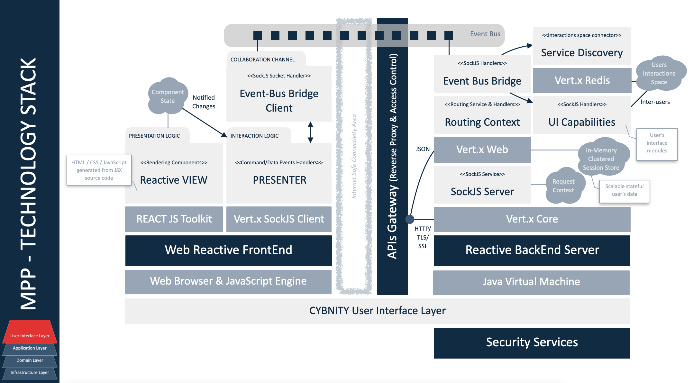
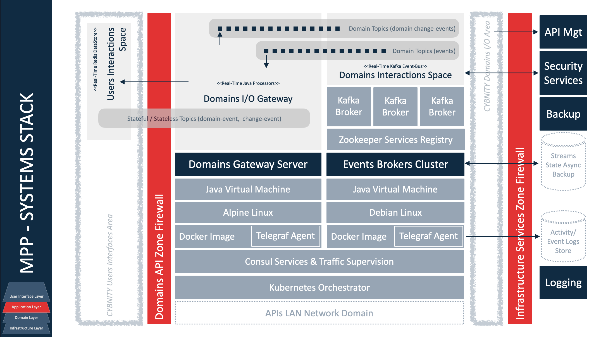
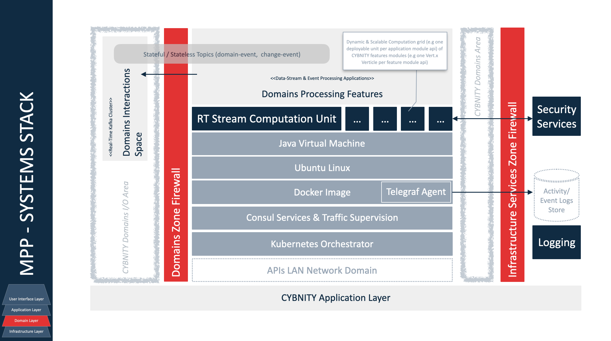
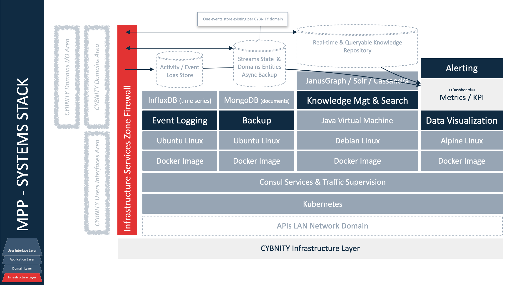

## PURPOSE
This section develop, document and elaborate detailed designs progressively using agreed-on and rapid agile development techniques, addressing all components (business processes and related automated and manual controls, supporting IT applications, infrastructure services and technology products, and partners/suppliers). Ensure that the detailed design includes internal and external SLAs and OLAs.

This section presents the design specifications about the solutions and technology approved as Minimum Prototyping Platform (MPP).

# MPP LONG TERM GOALS AND REQUIREMENTS
Presents the standard goals that should be reached and benefits that are targeted to be collected from the official technology stack by CYBNITY projects.

A set of common requirements is defined as frame of principles need to be maintained by any version of the CYBNITY official technology stack.
It's possible that new goals entry enhance the common goals, regarding specific technology and/or implementation layers during a new version development of the standards catalog.

### OBJECTIVES
Respond to the set of common requirements defined as frame of principles need to be maintained by any version of the CYBNITY official technology stack.

Definition of a minimal set of components allowing to:
- build and deliver a first version of CYBNITY demonstrator regarding UI cockpits principles;
- build and deliver a first version of a CYBNITY prototype of basic features for demonstration to potential partners' ecosystem;
- create the first version of TechStack official catalog version.

### SUPPORTED REQUIREMENTS
#### ARCHITECTURE
Should allow build of a first implementation architecture respecting the target architecture defined by Foundation project ready for deployment as an Internet platform usable for demonstration and motivation of partnerships.

#### DESIGN & DEMONSTRATOR
Should provide basic technologies set allowing the development of a first prototype aligned with the visual demonstrator of Cockpits concept.

#### USER INTERFACE LAYER
**Dynamics**

Should be reactive: frontend and backend components should maintain up-to-date states of domain events (e.g domain data state changes) and collaboration data (e.g shared data, contextualized capabilities during a security crisis situation) when collaboration data are managed in real-time between several CYBNITY users connected via their CYBNITY cockpits).

**Context and local persistence**

Should proposed personal management of real-time data dedicated to the connected user in dedicated space (e.g session during cockpit access, when a user prepare a draft of a security information before to commit it in a transaction mode to a CYBNITY domain).

**Integration with domains**

Should be integrated in real-time with domain over bridge to event bus and data spaces shared with security domains (e.g centralized), in a standard mode allowing scalable backend/frontend services, but with a standard integration to the domain applications (e.g application components) via middleware platform (e.g messaging system).

#### APPLICATION LAYER
**Processing and distribution of load**

Should start in a moderate time duration, but should have an acceptable reactivity SLA during the demonstration period allowing to check a realistic behavior of the UI Cockpits principles.

None requirement about support of data volume operated by the demonstrator using the stack (first phase of the CYBNITY project without challenges about the data load performance).

**Access and usage via Internet**

Should be usable via Internet for remote demonstration through a web browser hosted on a laptop or tablet, connected to Internet over a 4G bandwidth.

#### INFRASTRUCTURE LAYER
**Environments and locations**

Should support implementation of applications capable to run on several infrastructure environment types (environment profiles):
  - **local**: developer's workstation during unit development activities;
  - **dev**: common development server shared between developers collaborative activities and integration tests during unit development of integrated features;
  - **test**: server environment (no mirror of production environment) dedicated to quick tests when lot of infrastructure or environment changes are developed;
  - **staging**: pre-production server environment (mirror of production environment) that contain next version of applications, used for final integration testing and for test/demonstration of deployment repetition or performance demonstration;
  - **production**: production (live) server environment.

**Hosting and execution platform**

Should be virtualizable (e.g Docker containerized) allowing an installation/execution on a public cloud host (e.g IAS, PAAS), or an independent laptop without Internet connection.

#### TOOLING & SUPERVISION
Should allow definition and test of basic software factory implementation allowing to deliver Dockerized systems.

None supervision requirements required regarding the step of the CYBNITY Foundation project.

# CURRENT MPP OFFICIAL VERSION
- Version: 0.8.0
- Released at: Feb, 11, 2023
- Status: `RELEASED`
- Documentation: [technologies-stack-analysis](technologies-stack-analysis.md)
- Deliverables:
  - [Maven pom.xml](pom.xml) reusable by Java projects implementation which standardize their structure and usable authorized libraries versions. See [dependencies tree report](mpp-official-version-pom-tree.txt)
  - Add parent node in any Maven implementation project to be supported by Techstack, and a reference to the CYBNITY public repository for automatic parent download

    ```xml
    <parent>
      <groupId>org.cybnity</groupId>
      <artifactId>techstack</artifactId>
      <version>0.8.0</version>
    </parent>

    <repositories>
      <repository>
        <id>space-cybnity-open-source</id>
        <url>https://maven.pkg.jetbrains.space/cybnity/p/cybnity-os/cybnity-open-source</url>
        <snapshots>
          <enabled>false</enabled>
        </snapshots>
        <releases>
          <enabled>true</enabled>
        </releases>
      </repository>
    </repositories>
    ```

  - Tooling:
    - Profiles are available for developer and build chain regarding CYBNITY stages:
      - id: **commit-stage**

        Build phase regarding a software version development (e.g coding of feature).

        Activation via command line with ```-Dstage=commit```

      - id: **technical-quality-stage**

        Phase of technical quality validation of a software version (e.g alpha version).

        Activation via command line with ```-Dstage=technical-quality```

      - id: **integration-quality-stage**

        Phase of integration quality validation of a software version (e.g on an test environment).

        Activation via command line with ```-Dstage=integration-quality```

      - id: **user-acceptance-test-stage**

        Step of software behavior validation by testers community (e.g regarding a software beta release).

        Activation via command line with ```-Dstage=user-acceptance-test```

    - Profiles are available for developer and build chain regarding execution environments:
      - id: **localhost**

        Developer workstation environment.

        Active by default.

      - id: **dev-deploy-environment**

        Shared development platform between developers.

        Activation via command line with ```-Denvironment=dev-deploy```

      - id: **qa-environment**

        Test environment.

        Activation via command line with ```-Denvironment=qa```


## STANDARD TECHNOLOGIES STACK
Presentation of the technologies and frameworks used for implementation of the CYBNITY software projects.

### Application Layer

| Name | Usage | Solution Type | Technology | Runtime Infrastructure Target |
| :--- | :--- | :--- | :--- | :--- |
|ReactBootstrap|User Interface rendering|UI widgets library as GUI Graphic Components|Javascript, HTML5, CSS|Web Browser Javascript engine, HTML/CSS parser|
|Vert.x SockJS Client|FrontEnd/BackEnd messaging with SockJS servers|JavaScript event bus bridge to Vert.x server-side services|Javascript, JSON, TCP, HTTP WebSocket|JVM|
|Vert.x SockJS Event Bus Bridge|Web browser integration with SockJS servers|Extension of server-side distributed event bus into client side JS|Javascript, JSON|JS engine|
|ReactJS|Real-Time web GUI|Web reactive framework for dynamics component rendering (View/Presenter model)|Javascript, JSON, HTML, CSS, JSX|JS engine|
|NodeJS|UI reactive event-based application|Asynchronous event-driven JavaScript runtime|Javascript|Linux|
|JavaScript|UI/Application logic programming|Functional and/or Oriented-Object functions library|Javascript|JS engine|
|JSON|Data and event messages structure|Text structure of information|Text, Charset|JSON parser, communication/storage systems|
|Vert.x Web|Backend application logic/service|Server-side components and services exposure/bridge (UI backend)|Java, JSON, HTTP|Vert.x Core|
|Vert.x OAuth2|Interactions with SSO provider(s)|Extension connector with OAuth2 providers (Keycloak server)|Java, OpenID Connect, TCP|Vert.x Core|
|Vert.x JWT|JWT token check/read|Extension connector for JWT token management|Java, JWT|Vert.x Core|
|Vert.x Core|Asynchronous and non-blocking reactive systems|Server-side services components (UI capabilities)|Java, JSON|JVM|
|Keycloak|Providing and control of SSO elements|Dynamic part of IAM regarding final user's accounts and authentications|OpenID Connect, Java, JWT, PostgreSQL|JVM|
|Jackson Databind|Java Plain Object / JSON structures mapping|Binding library|Java, JSON|JVM|
|Java|UI/Application logic programming|Oriented-Object language sdk|Java|JVM|

### Infrastructure Layer

| Name | Usage | Solution Type | Technology | Runtime Infrastructure Target |
| :--- | :--- | :--- | :--- | :--- |
|Vert.x Redis Client|Interactions with Redis messaging system(s)|Extension connector with Redis broker(s)|Java, JSON|Vert.x Core|
|Lettuce Redis Client|Interactions with Redis messaging system(s)|Client library for integration with Redis broker(s)|Java, JSON|JVM|
|Vert.x Kafka Client|Interactions with Kafka messaging system(s)|Client library for integration with Kafka broker(s)|Java, JSON|Vert.x Core|
|Zookeeper Client|Interactions with Zookeeper directory|Client library for access to resources directory (e.g Kafka, Redis brokers)|Java|JVM|
|Redis|Interactions between UI layer's service components|Broker of distributed events, persistence of shared data|Java, JSON|JVM|
|Kafka|Interactions between application layer's service components|Broker of distributed events|Java, JSON|JVM|
|Temurin JVM|Runtime of application service layers|Execution environment of Java components|Java|OS, Docker|
|Zookeeper|Discovery and systems' access configurations management|Directory/broker of access informations to services components (e.g Kafka, Redis brokers)|Java|JVM|
|PostgreSQL|Persistence of SSO elements|Database of security elements regarding users' access controls|SQL|OS, Docker|
|Linux Alpine|Operating System of application/infrastructure components|Linux based operating system|Linux Kernel|Docker|
|Linux Debian|Operating System of application/infrastructure components|Linux based operating system|Linux Kernel|Docker|
|Helm|Configuration management (resources definition) of repeatable application installation (via manifesto) of components into a Kubernetes cluster|Infrastructure-As-Code tool|Helm Chart|Kubernetes|
|Docker Container|Server virtualization management of applicative/infrastructure systems|Templated system image instance and runtime|YAML file|Docker Runtime, Linux libraries|
|Kubernetes Cluster|Orchestration management of services components and application nodes|Infrastructure-As-Code tool|Kubernetes|OS, Kubernetes orchestrator|
|Terraform|Provisioning management of networking, load balancing, database, users, permissions and services values defining a runtime environment as Kubernetes cluster, and building configuration (Helm manifesto) of provisionable components|Infrastructure-As-Code tool|Terraform files|OS|

### Physical Infrastructure Layer

| Name | Usage | Solution Type | Technology | Runtime Infrastructure Target |
| :--- | :--- | :--- | :--- | :--- |
|x86 CPU|Processing of systems and OS|Computation Processing Unit|x86 instructions set| |

## LAYER ARCHITECTURE
### UI Layer



### Application Layer




### Application-Domain Layer




### Runtime Model


### Infrastructure Layer


## ARCHITECTURE CONCEPTS
### Event-Based Principles


#
[Back To Home](../README.md)
