# CYBNITY PROTOTYPE SYSTEMS DEPLOYMENT & RUN
## BUILD OF COMPONENTS & SYSTEMS
### Java components build
* From shell command line executed from the [root directory](../):

  ```shell
  mvn clean install
  ```

All the prototype components are built and available into the local Maven artifacts repository.

### Proto backend UI server

#### Vert.x components layer
During coding activity of this component, the Vert.x modified contents can be considered by the runtime with the shell command lines:
* Package the server service:

  ```shell
  mvn package
  ```

* Start the server Vert.x server-side backend system:

  ```shell
  mvn exec:java
  ```

#### ReactJS components layer (frontend)
[Babel](https://babeljs.io/docs/en/) JavaScript compiler (allowing code to works in current browsers) is used into the backend's static [index.html](proto-backend-ui-server/src/main/resources/static/index.html) page for integration between Vert.x and ReactJS.

Requirements: install Node (see [Nodejs](https://nodejs.org/en/) documentation) and NPM tools according to the development workstation's operating system.

* Check the Node and NPM versions supported by the development workstation via shell command line:

  ```shell
  node --version

  npm --version
  ```

* Navigate into the [proto-frontend-ui-server](proto-frontend-ui-server) directory

* Start the React web application (usable from web browser at http://localhost:3000) via the execution of the shell command line (which execute the scripts defined by the package.json file):

  ```shell
  npm start
  ```

The workstation's default web browser is automatically opened on the React App, and the NodeJS process is started as web application into the command line console. The frontend development server ensure the backend functions.

* A possible tests execution can be started from shell command line:

  ```shell
  npm test
  ```

Documentation about integration between Vert.x and ReactJS is available on [Eclipse Vert.x How-To](https://how-to.vertx.io/single-page-react-vertx-howto/).

## START OF SYSTEMS
The start of [infrastructure services](../proto-infrastructures/README.md) is __required before to execute the start of prototyped systems__.

The CYBNITY prototyped systems are managed into the Maven sub-project named __proto-asset-control__.

The systems are integrated according to an even-based architecture supported by an integration chain of events (e.g Command, Query, Notification):

```mermaid
flowchart LR
	subgraph cybnity_systems[POC CYBNITY systems]
		subgraph uibackend[Proto Backend UI Server]
			AreasAssetsProtectionUICapabilityHandler:::system;
		end
		subgraph areasassetsprotectiongateway[Proto Domain Gateways Server]
			AreasAssetsProtectionSecurityCapabilitiesDispatcher:::system;
			DownloadReportProcessingCapabilityHandler:::system;
			AssetControlSecurityFeaturesDispatcher:::system;
		end
		subgraph assetcontrol_cpunit[Proto RTS Computation Unit Server]
			CreateAssetFeature:::system;
		end
	end
	subgraph dmbroker[Domains Interactions Space]
		ac_createAsset:::techcomp;
		ac_findAssets:::techcomp;
	end
	subgraph uibroker[Users Interactions Space]
		aapdp[aap_downloadReport]:::techcomp;
		aap[areas_assets_protection]:::techcomp;
		asset_control_api[asset_control]:::techcomp;
	end
	subgraph busbroker[localhost:8080/eventbus]
		aap_in[aap.in]:::techcomp;
		aap_out[aap.out]:::techcomp;
	end
	AreasAssetsProtectionUICapabilityHandler -- 1.2, 2.2 : in progress notification --> aap_out;
	aap_in -- 2: findAssets query --> AreasAssetsProtectionUICapabilityHandler -- 2.1 findAsset event --> aap --> AreasAssetsProtectionSecurityCapabilitiesDispatcher;
	aap_in -- 1: createAsset command --> AreasAssetsProtectionUICapabilityHandler -- 1.1 createAsset event --> aap --> AreasAssetsProtectionSecurityCapabilitiesDispatcher;
	aap_in -- 3: downloadReport command --> AreasAssetsProtectionUICapabilityHandler;
	AreasAssetsProtectionUICapabilityHandler -- 3.1 downloadReport event --> aapdp --> DownloadReportProcessingCapabilityHandler;
	AreasAssetsProtectionSecurityCapabilitiesDispatcher -- 1.3: createAsset event --> asset_control_api;
	AreasAssetsProtectionSecurityCapabilitiesDispatcher -- 2.3: findAsset event --> asset_control_api;
	asset_control_api --> AssetControlSecurityFeaturesDispatcher;
	AssetControlSecurityFeaturesDispatcher -- 1.4: createAsset command --> ac_createAsset -- 1.5: createAsset event --> CreateAssetFeature;
	AssetControlSecurityFeaturesDispatcher -- 2.4: findAssets query --> ac_findAssets;

	uibackend:::componentlayer;
	areasassetsprotectiongateway:::componentlayer;
	assetcontrol_cpunit:::componentlayer;
	busbroker:::area;
	uibroker:::area;
	dmbroker:::area;
	cybnity_systems:::techsys;

	classDef system fill:#3a5572,stroke:#3a5572,color:#fff;
	classDef componentlayer fill:#97A5B5,stroke:#97A5B5,color:#fff;
	classDef techcomp fill:#fff,stroke:#3a5572,color:#3a5572;
	classDef techsys fill:#fff,stroke:#e5302a,color:#e5302a;
	classDef area fill:#fff,stroke:#3a5572,color:#3a5572,stroke-width:1px,stroke-dasharray: 5 5;
```



### RTS Computation Unit server
Start the RTS Computation Unit server __from the proto-rts-computation-unit-server__ Maven sub-project directory:
- From Eclipse IDE (since src/test/java sub-directory), execute the `org.cybnity.application.asset_control.domain.system.AssetControlRTComputationUnitLauncher` class as Java application.

- or from shell command line (since the project's target sub-directory), execute the java main class with command line instruction  `java org.cybnity.application.asset_control.domain.system.AssetControlComputationUnit`.

When start process is executed:
  - The RTS unit server instance is started and automatically connected to the Domains Interactions broker (Kafka);
  - The java console's output show the processed events received from the UI layer (e.g domain gateways) via all the integration chain.

### Domains Gateway servers
__From the proto-domain-gateway-server__ Maven sub-project directory, start the multi domains gateway (simulated in unique project including implementation of a gateway about UI capabilities, and of a gateway about the asset control features domain) which manage the start of two Vert.x Verticles dedicated to each gateway instance:
- From Eclipse IDE (since src/test/java sub-directory), execute the `org.cybnity.application.MultipleDomainGatewayLauncher` class as Java application.

- or from shell command line (since the project's target sub-directory), execute the java main class with command line instruction  `java org.cybnity.application.MultipleDomainGateway`.

When start process is executed:
  - One UI capabilities gateway relative to Assets & Areas Protection is started (ready for process UI capabilities command events received from backend ui server over the Users Interactions Space):
    - Its console's output show the collected events from UIS broker, treated by UI capability (via channels of UIS) or dynamically delegated to the  identified applicative domain(s) (e.g to Asset Control domain via event forward to its API channel entry point).
  - One applicative domain IO gateway relative to Asset Control domain is started (ready for process the security features command events supported by the Asset Control domain, coming from UI layer via the User Interactions Space and requiring dispatch on Domains Interactions Space):
    - Its console's output show the collected and dispatched to application layer.

### Backend UI server
__From the proto-backend-ui-server__ Maven sub-project directory, start the backend service ensuring the web exposure of web UI, and CYBNITY prototype UI layer (e.g html/javascript, ui services API via Vert.x event bus over HTTP):
- From Eclipse IDE (since src/test/java sub-directory), execute the `org.cybnity.application.asset_control.ui.system.backend.SockJSReactiveBackendServerLauncher` class as Java application.

- of from shell command line (since the project's target sub-directory), execute the java main class with command line instruction  `java org.cybnity.application.asset_control.ui.system.backend.SockJSReactiveBackendServer`.

When start process is executed:
  - The UI backend server instance is started and automatically expose a http service on port 8080;
  - The java console's output show the http requests received from the front end layer (e.g web client or web browser) and treatment logs (e.g return of html static contents, delegation to UI capabilities layer).

# INTEGRATION TEST PROTOCOL
## TEST OF UI BACKEND ENDPOINTS (static contents)
### From shell command line
1. Test that ui backend give answer about sent parameter (over HTTP/GET protocol) without specific route to defined UI capability:

    ```shell
    curl -v http://localhost:8080/assetcontrol/
    ```

2. Test that UI backend give answer about sent parameter (over HTTP/GET protocol) from specific route defined about UI capability handled:

    ```shell
    curl -v http://localhost:8080/assetcontrol/\?name\="olivier"
    ```

### From web browser
1. Test that UI backend give static resources with default index.html reactive page display

    ```shell
    http://localhost:8080/static/
    ```

2. Test that UI backend give answer about sent parameter (over HTTP/GET protocol)

    ```shell
    http://localhost:8080/assetcontrol/?name=olivier
    ```

## TEST OF WEB UI (static contents and dynamic interactions)
The scope of test implementing the usage of static contents and event-bus interactions over Vert.x event bus is accessible with a web browser calling the url `http://localhost:8080/static/`.

When the main test page is shown, some automatic requests are executed by the page in asynchronous process (e.g implemented via javascript instructions using the Vert.x web client connected to the ui backend server).

The sent and received events are displayed into the web console of the web browser allowing to follow the JSON commands and responses exchanged between the frontend layer (browser) and the backend layer (proto-backend-ui-server system).

Each command (which is automatically generated by this page) produce automatic and reactive treatment into the backend, domain gateways and RTS computation unit server components (e.g traces generated in each of their consoles).
